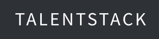

# README

TalentStack is a web application designed to connect entrepreneurs with similar ideas and interests. Although this is a project in the making, originally used as my capstone project for the Actualize bootcamp, the hope is to polish this full-stack application so that users can sign up and post their ideas to receive feedback, advice and potentially find others interested in helping them pursue their vision.

This application uses the Ruby on Rails and Vue.js frameworks.

